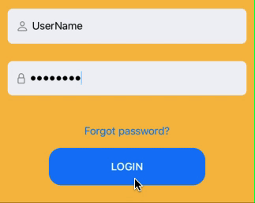

# Bruter : an ethical hacking tool, complementary to hydra, to brute force the login page of a website.

## Why Bruter ?
This tool implements a missing feature in Hydra, and that i couldn't find in other brutefocing tools, wich is the possibility to bruteforce a login page that doesn't have a login failure message (like "incorrect password" or "authentification failed" etc...)

In hydra, to bruteforce a login page, you have to provide a failure message, so that hydra knows when a login attempt failed or succeded, and then give you the correct credentials. but sometimes, login pages don't have a failure message, instead, they have an animation (shaking form for example) to indicate that the login attempt failed, or don't indicate at all 



This is where this tool comes in handy, it checks if there's a redirection to a specific page (dashboard for example) or if an auth cookie is set etc... and uses this as a basis to return correct credentials.

## Usage

Clone the repository and install the requirements:
```bash
git clone https://github.com/reda-benmakdad/bruter.git

cd bruter

pip install -r requirements.txt
```

Then, you can use the tool like this:
```bash 
python bruter.py -u http://example.com/login -L users.txt -P passwords.txt
```

or you can use the help command to see all the options:
```bash
python bruter.py --help
```

## Development
This project is still in the development, i am still working on it to add more checks and coditions to know if the login attempt failed or succeded without a failure message, and to make it more efficient and faster.
if you have any suggestions or ideas, feel free to open an issue or a pull request.


